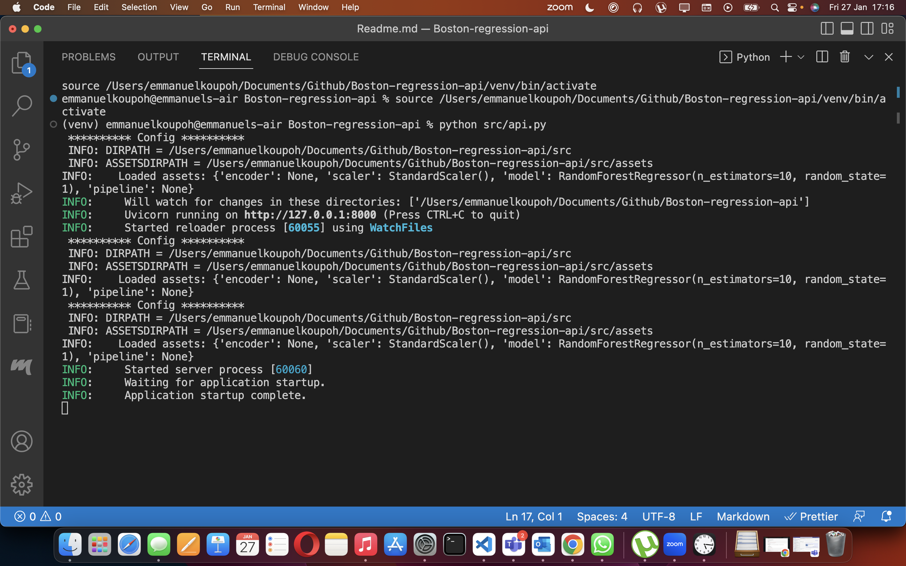
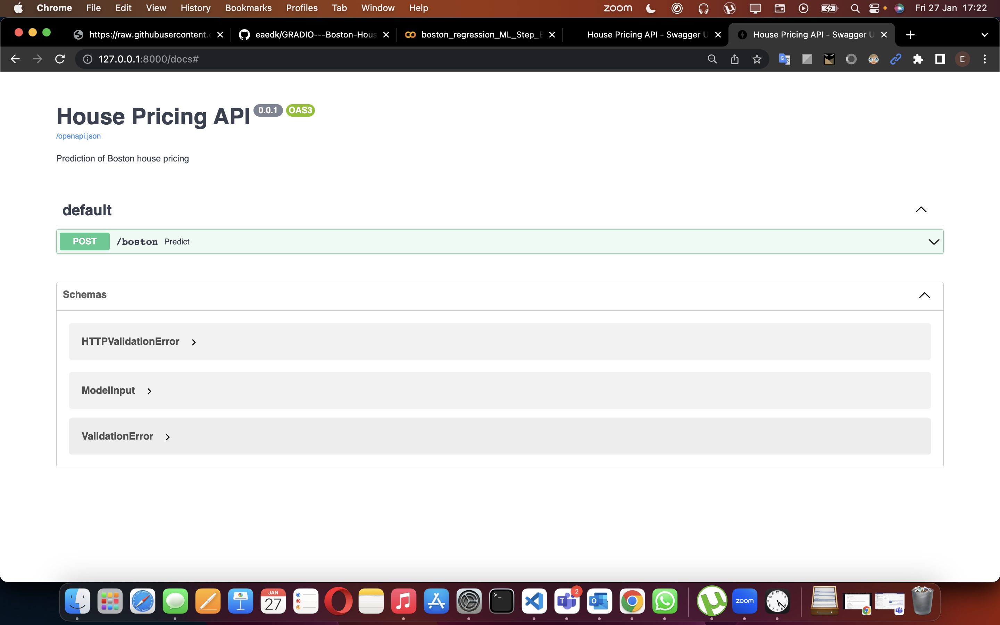

# ML API using Boston Housing dataset
The purpose of this project is to create an ML API endpoint to predict against the request received from the client.

## Setup
Find the commands below to setup this project and execute it. You must install Python3 (<3.10)

- Windows:
        
        python -m venv venv; venv\Scripts\activate; python -m pip install -q --upgrade pip; python -m pip install -qr requirements.txt  

- Linux & MacOs:
        
        python3 -m venv venv; source venv/bin/activate; python -m pip install -q --upgrade pip; python -m pip install -qr requirements.txt  

## Execution
To run this project, please type the command below being at the repo's root:

        python src/api.py 

Below is the expected output :

## Additional info
View of the API's documentation in your browser

[Click this to open the docs in you browser](http://127.0.0.1:8000/docs)

# Authors
- [Richard Kadey]()

- [Emmanuel KOUPOH]()
 
<!-- - 
- 
- 
- 
-  -->